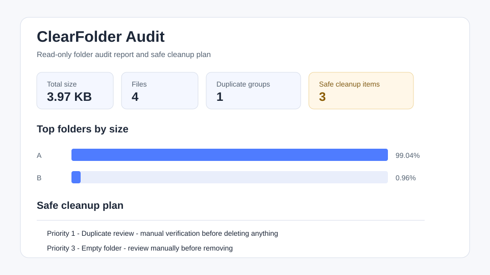

# ClearFolder Audit

**ClearFolder Audit** is a small, portable, read-only Windows folder audit tool.

It scans a selected folder and creates a safe cleanup report with top subfolders by size, largest files, SHA-256 duplicates, empty folders, extension distribution, file age, Safe Cleanup Plan, and HTML/CSV exports.

The app is intentionally **read-only**. It does not delete, move, rename, upload, or modify your files.



## Download

Supporter download on Gumroad: https://kasprian.gumroad.com/l/clearfolder-audit

The Gumroad ZIP includes the portable Windows EXE, documentation, license, and sample report.

This repository contains the source code and demo materials so users can inspect what the tool does before downloading or purchasing the packaged build.

## Why this exists

WizTree, TreeSize, and WinDirStat are excellent disk analyzers. ClearFolder Audit has a narrower goal: a simple, safe, evidence-first folder audit report before cleanup.

## Features

- Windows GUI built with C# WinForms.
- Folder picker and recursive scan.
- Filters for extensions, folder names, and minimum file size.
- Progress display and cancel button.
- Sortable result tables.
- Open/select results in Windows Explorer.
- HTML report with visual bar charts.
- CSV export bundle.
- Local-only operation.

## Build

```powershell
powershell -ExecutionPolicy Bypass -File .\Build.ps1
```

Output:

```text
dist\FolderAuditTool.exe
```

## Test

```powershell
powershell -ExecutionPolicy Bypass -File .\Test.ps1
```

The test script creates synthetic data, validates core results, checks exports, tests cancellation/access handling, and runs a 10,000-file load test.

## Current limitations

- Windows-only.
- Unsigned EXE in current release.
- No treemap.
- No direct NTFS MFT fast scan.
- Exact duplicate detection only.
- Safe Cleanup Plan is advisory and manual; it does not delete files.

## License

MIT License. See [LICENSE](LICENSE).
